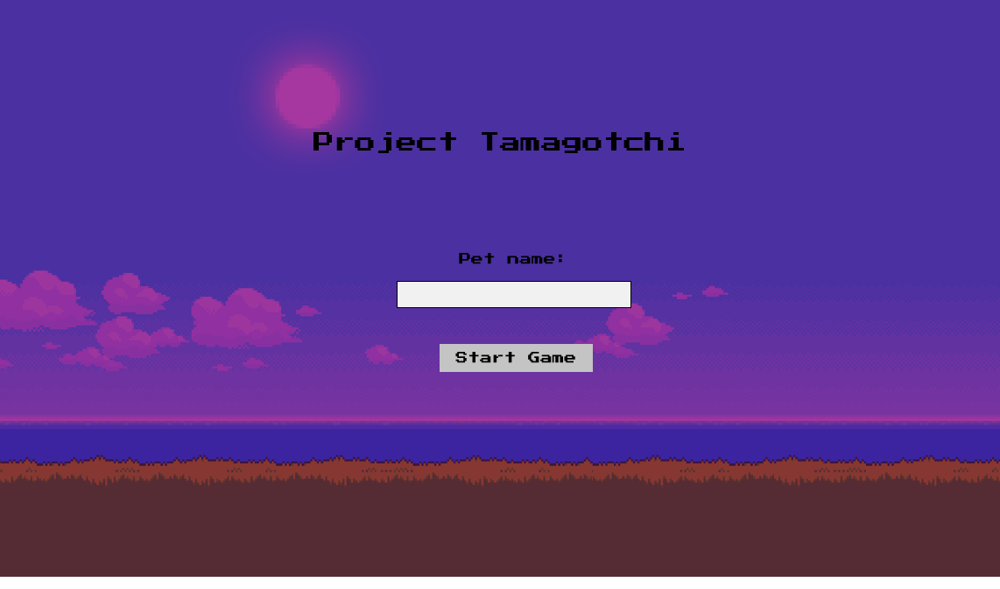
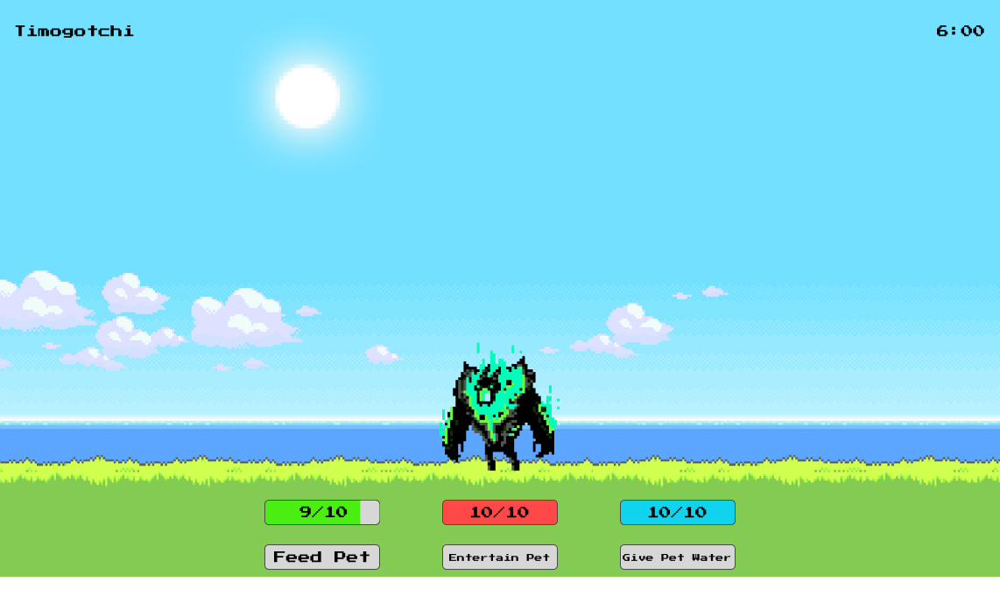

# Project Tamagotchi

## About the Project

This project is a Tamagotchi clone.

## User Stories

Display a character of the player's choice on the screen

Display the following statuses (1-10 scale):

- Hunger
- Sleepiness
- Boredom
- Age

Add buttons to feed your pet (Hunger), turn off the lights (Sleepiness), and play with your pet (Boredom)

Add the ability to name the pet

Increase Pet's age every x minutes

Increase your pet's Hunger, Sleepiness, and Bored metrics on an interval of your choosing.

- Stretch - Balance each stat individually, Boredom should increase fastest, hunger should increase slower than boredom but faster than sleepiness, sleepiness should increase slowest

Pet should die if Hunger, Boredom, or Sleepiness hits 10.

Stretch - Morph your pet at certain ages.

Stretch - Animate your pet across the screen while it's alive, and change to a different animation and image on death, or victory.

## Technologies Used

- HTML
- CSS
- Javascript

## Approach

### Step One

- Wireframing completed.

### Step Two

- User stories thought out, and added to readme.

### Step Three

- Basic HTML and CSS added.

### Step Four

- Basic Javascript added.
- MVP complete.

### Step Five

- Additional functionality added.

## Installation Instructions

-Clone repo.
-Open index.html in your browser.